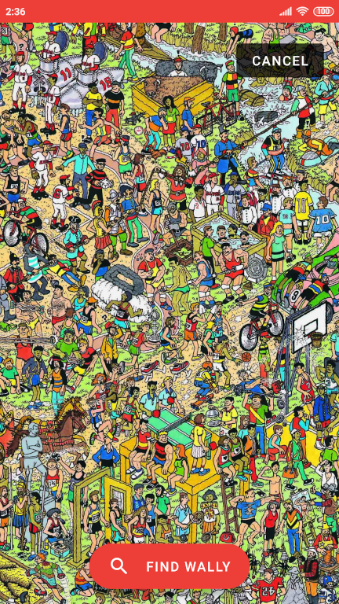

<p align="center"></p>


## About
Android application that solves the game _Where's Wally?_ using Neural Networks.


## Installation
The app can be installed using [Android Studio](https://developer.android.com/studio).

First, clone the repository with:
```
git clone https://github.com/franksacco/where-is-wally.git
```
From Android Studio, select *Import Project*, then select the folder `android` of the cloned repository.\
Click *Make Project* to build the app and download all the required dependencies.\
Click *Run app* to install the app on your device or emulator.


## Screenshots

<p float="left">
  
  
  
</p>


## Performances

I installed the application on my phone and I ran some tests using 3 sample images to measure the time it took to locate Wally.

Below, I report the specifications for the phone and the sample images.

| Device  | Xiaomi Redmi 4 Pro                      |
| ------- | --------------------------------------- |
| OS      | Android 6.0.1 (Marshmallow), MIUI 10.2  |
| Chipset | Qualcomm MSM8953 Snapdragon 625 (14 nm) |
| CPU     | Octa-core 2.0 GHz Cortex-A53            |
| GPU     | Adreno 506                              |
| RAM     | 3 GB                                    |

| Image | Original size | Size with padding | Number of sub-images/tasks |                                              |
| :---: | :-----------: | :---------------: | :------------------------: | -------------------------------------------- |
| 1     | 256 x 256     | 256 x 256         | 1                          | [View image](data/256x256/16_image.jpg)      |
| 2     | 2953 x 2088   | 3072 x 2304       | 108                        | [View image](data/old_original/20_image.jpg) |
| 3     | 4130 x 2455   | 4352 x 2560       | 170                        | [View image](data/original/02_image.jpg)     |

Here I show you some interesting statistics about the tests performed.

| Image | GPU                      | Parallel tasks | Total time | Tasks time | Average time per task | Max RAM used * |
| :---: | :----------------------: | :------------: | :--------: | :--------: | :-------------------: | :------------: |
| 1     | :heavy_multiplication_x: | 1              | 2.020 s    | 1.790 s    | 1.790 s               | 345.2 MB       |
| 1     | :heavy_check_mark:       | 1              | 2.735 s    | 0.404 s    | 0.404 s               | 189.9 MB       |
| 2     | :heavy_multiplication_x: | 1              | 204.598 s  | 160.106 s  | 1.482 s               | 424.2 MB       |
| 2     | :heavy_check_mark:       | 1              | 91.729 s   | 45.360 s   | 0.420 s               | 334 MB         |
| 2     | :heavy_multiplication_x: | 2              | --         | --         | --                    | *OOM* \*\*     |
| 2     | :heavy_check_mark:       | 2              | 80.873 s   | 34.304 s   | 0.318 s               | 342.9 MB       |
| 3     | :heavy_multiplication_x: | 1              | 319.213 s  | 250.332 s  | 1.473 s               | 495.0 MB       |
| 3     | :heavy_check_mark:       | 1              | 142.445 s  | 70.834 s   | 0.417 s               | 402.7 MB       |
| 3     | :heavy_multiplication_x: | 2              | --         | --         | --                    | *OOM* \*\*     |
| 3     | :heavy_check_mark:       | 2              | 126.331 s  | 54.162 s   | 0.319 s               | 422.1 MB       |

(\*) Measured using [Android Studio Profiler](https://developer.android.com/studio/profile/android-profiler)\
(\*\*) Out of memory


## Author
 - [Francesco Saccani](https://github.com/franksacco) (francesco.saccani2@studenti.unipr.it)
